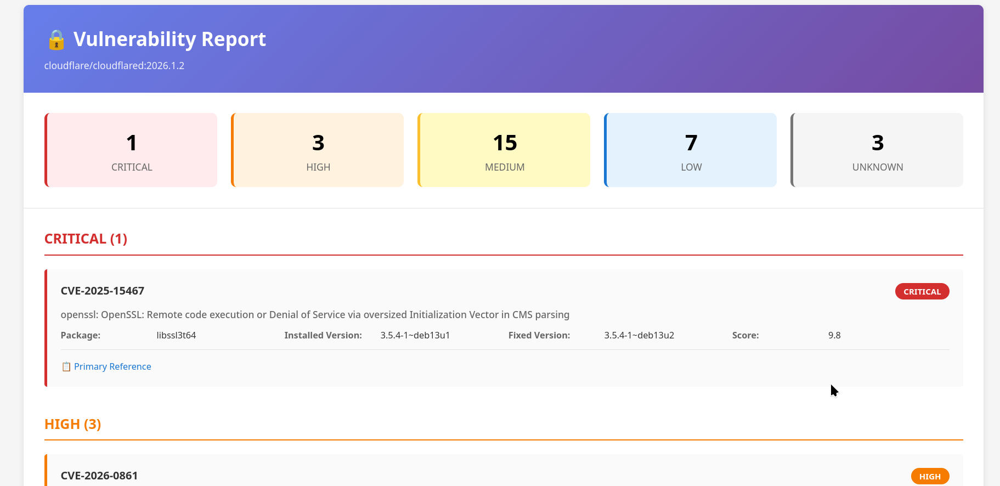

# Trivy Operator HTML Report Generator

Convert Kubernetes VulnerabilityReports from Trivy Operator to ~~beautiful~~ HTML format.



## Features

- Beautiful, responsive HTML reports with color-coded severity levels
- Automatic report generation via CronJob
- Web interface to browse all reports
- Summary dashboard showing vulnerability counts
- Easy deployment with single script

## Prerequisites

- Kubernetes cluster with Trivy Operator installed
- `kubectl` configured with cluster access
- `jq` (JSON processor)
- **Note:** Trivy CLI is NOT required

## Quick Start

Deploy everything with one command:

```bash
./deploy.sh
```

This will:
1. Create namespace (default: `trivy-test`)
2. Create ConfigMaps from your local scripts
3. Deploy CronJob (runs hourly)
4. Deploy nginx web server
5. Create Ingress for web access

### Custom Namespace and Domain

```bash
# Custom namespace
NAMESPACE=my-namespace ./deploy.sh

# Custom domain
DOMAIN=trivy.example.com ./deploy.sh

# Both
NAMESPACE=my-namespace DOMAIN=trivy.example.com ./deploy.sh
```

## Manual Usage

Generate reports manually:

```bash
# List all reports
./trivy-report-to-html.sh --list

# Generate single report
./trivy-report-to-html.sh --namespace argocd --report <report-name> --output report.html

# Generate all reports in namespace
./trivy-report-to-html.sh --namespace argocd --all --output ./reports
```

## Access Reports

After deployment, access the web interface at the configured domain (default: `http://trivy-reports.example.com`).

The nginx server displays a directory listing of all generated HTML reports.

## Automation

### CronJob (Default)

Runs every hour automatically:
- Cleans up old reports
- Scans all namespaces
- Generates HTML for all VulnerabilityReports

**Schedule:** `0 * * * *` (hourly)

Edit [kubernetes/cronjob.yaml](kubernetes/cronjob.yaml#L36) to change frequency.

### Manual Trigger

Run the CronJob immediately:

```bash
kubectl create job --from=cronjob/trivy-html-report-generator manual-run-$(date +%s) -n trivy-test
```

### Real-time Watcher (Optional)

Deploy a watcher that generates reports immediately when VulnerabilityReports are created/updated:

```bash
# During initial deployment, answer 'y' when prompted
# Or deploy separately:
kubectl apply -f kubernetes/deployment-watcher.yaml
```

To remove the watcher:
```bash
kubectl delete -f kubernetes/deployment-watcher.yaml
```

## Configuration

### Change CronJob Schedule

Edit `schedule` in [kubernetes/cronjob.yaml](kubernetes/cronjob.yaml):

```yaml
schedule: "*/15 * * * *"  # Every 15 minutes
schedule: "0 */6 * * *"   # Every 6 hours
schedule: "0 9 * * *"     # Daily at 9 AM
```

### Change Ingress Domain

Edit the Ingress in [kubernetes/cronjob.yaml](kubernetes/cronjob.yaml):

```yaml
spec:
  ingressClassName: traefik-internal
  rules:
  - host: your-domain.example.com
```

## Architecture

- **CronJob**: Periodically generates reports for all namespaces
- **PersistentVolume**: Stores generated HTML reports (5Gi)
- **Nginx**: Serves reports via web interface
- **Ingress**: Exposes reports with custom domain

## Troubleshooting

### Check CronJob Status

```bash
kubectl get cronjobs -n trivy-test
kubectl get jobs -n trivy-test
```

### View CronJob Logs

```bash
kubectl logs -n trivy-test job/<job-name>
```

### Check Reports

```bash
# List all VulnerabilityReports
kubectl get vulnerabilityreports --all-namespaces

# Check if reports were generated
kubectl exec -n trivy-test deployment/trivy-reports-nginx -- ls -lh /usr/share/nginx/html/
```

### Update Scripts

After modifying the scripts, redeploy:

```bash
./deploy.sh
```

This will update the ConfigMaps with your latest changes.

## Cleanup

Remove everything:

```bash
# Delete all resources
kubectl delete namespace trivy-test

# Or delete specific components
kubectl delete -f kubernetes/cronjob.yaml
```

## File Structure

```
.
├── trivy-report-to-html.sh       # Main conversion script
├── generate-html.sh               # HTML template generator
├── deploy.sh                      # Deployment automation
├── watch-and-generate.sh          # Local watch script (optional)
├── kubernetes/
│   ├── cronjob.yaml              # CronJob + nginx + Ingress
│   └── deployment-watcher.yaml   # Real-time watcher (optional)
└── README.md
```

## Requirements Summary

**Local execution:**
- kubectl
- jq

**Kubernetes cluster:**
- Trivy Operator (for VulnerabilityReport CRDs)
- Ingress controller (traefik-internal)
- StorageClass supporting ReadWriteMany

## License

MIT
